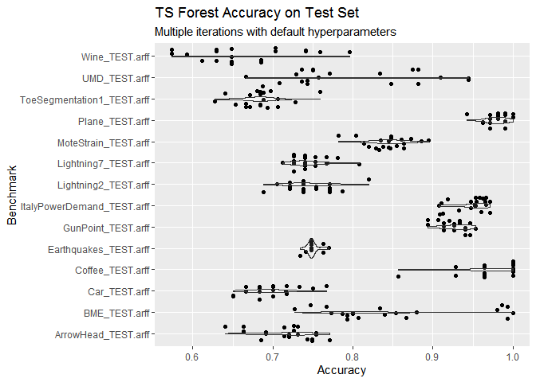

<!-- README.md is generated from README.Rmd. Please edit that file -->

# timeseriesclassbenchmarksr

<!-- badges: start -->

<!-- badges: end -->

This is me keeping track of the performance of various time series
classification benchmarks, like `tsforest` and `bagofpatternsr`.

``` r
library(ggplot2)
plot <- readRDS(file = "results/plotdata.rds")
plot + labs(title = "TS Forest Accuracy on Test Set", subtitle = "Multiple iterations with default hyperparameters")
#> Warning: Removed 60 rows containing non-finite values (stat_ydensity).
#> Warning: Removed 60 rows containing missing values (geom_point).
```

<!-- -->
